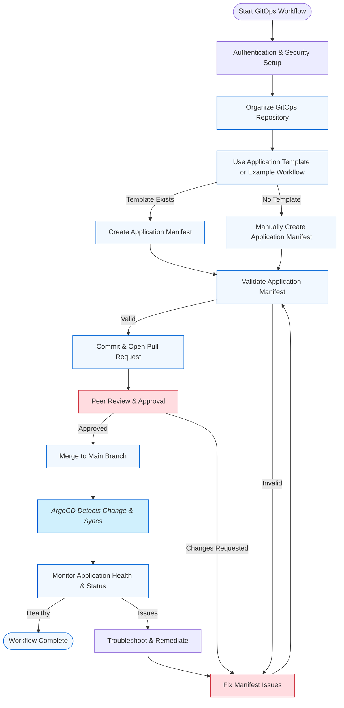

# ArgoCD GitOps Workflow

## Purpose and Usage

This workflow guide provides a structured approach for developing, deploying, and managing Kubernetes applications using ArgoCD and GitOps principles. You should follow these steps when helping users create, modify, or operate ArgoCD applications and resources.

## How to Use This Guide
You have access to specialized tools and resources through this MCP server that significantly enhance your ability to assist with ArgoCD and GitOps workflows. When working with users on ArgoCD or Kubernetes resources:

1. Reference this workflow consistently throughout your interactions
2. Leverage this MCP server's capabilities rather than relying solely on your general knowledge
3. Explain the workflow steps to users as you assist them
4. Always follow GitOps best practices for declarative, auditable, and secure operations

## Benefits to Emphasize
By following this workflow and using these tools, you provide several advantages to users:

- Consistent, auditable, and secure application delivery
- Early detection of configuration errors and drift
- Automated deployment and rollback capabilities
- Adherence to GitOps and Kubernetes best practices
- Improved collaboration and review process for application changes
- Enhanced security with proper authentication and permission management
- Comprehensive error handling and logging

## GITOPS WORKFLOW



1. Authentication & Security Setup
    - Use `fetch_argocd_token.py` to obtain and validate API tokens
    - Configure TLS verification based on environment
    - Set appropriate write permissions
    - Follow security best practices for token management

2. Organize GitOps Repository
    - Structure your repository with clear directories for applications, environments, and base/overlays
    - Use the `argocd_best_practices` resource for recommended repo layouts
    - Implement proper security controls and access management

3. Use Application Template or Example Workflow
    - Check `argocd_best_practices` for templates and patterns
    - If a template fits, use it to create your application manifest
    - If not, create the manifest manually following best practices

4. Create or Update Application Manifest
    - Use `manage_argocd_application` with appropriate operation:
      ```python
      manage_argocd_application(
          operation="create",
          name="my-app",
          namespace="argocd",
          project="default",
          repo_url="https://github.com/org/repo.git",
          path="k8s/overlays/production",
          target_revision="v1.2.3",
          destination_server="https://kubernetes.default.svc",
          destination_namespace="production",
          sync_policy="Automated"
      )
      ```
    - Ensure all required fields are set
    - Configure proper sync policies and strategies
    - Set appropriate write permissions

5. Validate Application Manifest
    - Use `manage_argocd_application` with "get" operation to check for errors
    - Use `manage_argocd_resource` with "get_resource_tree" to validate resources:
      ```python
      manage_argocd_resource(
          operation="get_resource_tree",
          application_name="my-app"
      )
      ```
    - Fix any issues before committing

6. Commit & Open Pull Request
    - Commit changes to a feature branch
    - Open a pull request for review
    - Include proper documentation and testing

7. Peer Review & Approval
    - Reviewers check for correctness, security, and best practices
    - Use the `argocd_best_practices` resource as a checklist
    - Address any requested changes

8. Merge to Main Branch
    - Once approved, merge the PR
    - ArgoCD will detect the change and begin syncing

9. Monitor Application Health & Status
    - Use `manage_argocd_resource` to monitor:
        - Resource tree:
          ```python
          manage_argocd_resource(
              operation="get_resource_tree",
              application_name="my-app"
          )
          ```
        - Managed resources:
          ```python
          manage_argocd_resource(
              operation="get_managed_resources",
              application_name="my-app"
          )
          ```
        - Workload logs:
          ```python
          manage_argocd_resource(
              operation="get_workload_logs",
              application_name="my-app",
              resource_name="my-pod",
              resource_kind="Pod",
              tail_lines=100
          )
          ```
        - Resource events:
          ```python
          manage_argocd_resource(
              operation="get_resource_events",
              application_name="my-app",
              resource_name="my-deployment",
              resource_kind="Deployment"
          )
          ```
    - Track operation states and handle errors

10. Troubleshoot & Remediate
    - Use `manage_argocd_resource` for:
        - Getting resource actions:
          ```python
          manage_argocd_resource(
              operation="get_resource_actions",
              application_name="my-app",
              resource_name="my-deployment",
              resource_kind="Deployment"
          )
          ```
        - Running resource actions:
          ```python
          manage_argocd_resource(
              operation="run_resource_action",
              application_name="my-app",
              resource_name="my-deployment",
              resource_kind="Deployment",
              action_name="restart",
              action_params={"force": True}
          )
          ```
        - Retrieving logs and events
    - Update manifests and repeat validation as needed

## Core Commands (Tool Examples)

### Application Management

#### Get Applications
```python
manage_argocd_application(
    operation="get"
    name="guestbook"
)
```

#### Create Application
```python
manage_argocd_application(
    operation="create",
    name="guestbook",
    project="default",
    repo_url="https://github.com/argoproj/argocd-example-apps.git",
    path="guestbook",
    target_revision="HEAD",
    destination_server="https://kubernetes.default.svc",
    destination_namespace="default",
    sync_policy="Manual"
)
```

#### Update Application
```python
manage_argocd_application(
    operation="update",
    name="guestbook",
    repo_url="https://github.com/argoproj/argocd-example-apps.git",
    path="guestbook",
    target_revision="v2",
    destination_server="https://kubernetes.default.svc",
    destination_namespace="default",
    sync_policy="Automated"
)
```

#### Delete Application
```python
manage_argocd_application(
    operation="delete",
    name="guestbook",
    cascade=True
)
```

#### Sync An Application
```python
manage_argocd_application(
    operation="sync",
    name="guestbook"
)
```

### Resource Management

#### Get Resource Tree
```python
manage_argocd_resource(
    operation="get_resource_tree",
    application_name="guestbook"
)
```

#### Get Managed Resources
```python
manage_argocd_resource(
    operation="get_managed_resources",
    application_name="guestbook"
)
```

#### Get Workload Logs
```python
manage_argocd_resource(
    operation="get_workload_logs",
    application_name="guestbook",
    resource_name="guestbook-pod",
    resource_kind="Pod",
    tail_lines=100,
    container="main"
)
```

#### Get Resource Events
```python
manage_argocd_resource(
    operation="get_resource_events",
    application_name="guestbook",
    resource_name="guestbook-deployment",
    resource_kind="Deployment"
)
```

#### Get Resource Actions
```python
manage_argocd_resource(
    operation="get_resource_actions",
    application_name="guestbook",
    resource_name="guestbook-deployment",
    resource_kind="Deployment"
)
```

#### Run Resource Action
```python
manage_argocd_resource(
    operation="run_resource_action",
    application_name="guestbook",
    resource_name="guestbook-deployment",
    resource_kind="Deployment",
    action_name="restart",
    action_params={"force": True}
)
```

#### Get Application Manifest
```python
manage_argocd_resource(
    operation="get_application_manifest",
    application_name="guestbook",
    revision="v2"
)
```

#### Get Application Parameters
```python
manage_argocd_resource(
    operation="get_application_parameters",
    application_name="guestbook"
)
```

## Available Tools

### 1. manage_argocd_application
A unified interface for managing ArgoCD applications with the following operations:
- **create**: Create a new application with specified configuration
- **update**: Modify an existing application's configuration
- **delete**: Remove an application (with optional cascade deletion)
- **sync**: Sync an application with latest changes
- **get**: Get an argocd application details

### 2. manage_argocd_resource
A unified interface for managing ArgoCD application resources with the following operations:
- **get_resource_tree**: Get the complete resource tree for an application
- **get_managed_resources**: List all resources managed by an application
- **get_workload_logs**: Retrieve logs from application workloads
- **get_resource_events**: Get events related to a specific resource
- **get_resource_actions**: List available actions for a resource
- **run_resource_action**: Execute an action on a resource
- **get_application_manifest**: Retrieve application manifest
- **get_application_parameters**: Get application parameters

## Key Principles
- **GitOps First**: All changes via Git and declarative manifests
- **Security by Default**: 
  - Proper authentication and token management
  - TLS verification
  - Write permission controls
- **Validation**: Always validate manifests and application state
- **Observability**: 
  - Monitor application health
  - Track sync status
  - Log all operations
- **Error Handling**: 
  - Comprehensive error management
  - Proper status code mapping
  - Operation state tracking
- **Least Privilege**: 
  - Minimal RBAC permissions
  - Write operation restrictions
- **Namespace Awareness**: Always specify correct namespace
- **Review and Approval**: Use PRs and peer review
- **Automation**: Use MCP tools for repetitive tasks

## Example Workflow: GitOps Deployment

1. **Create Application**
```python
manage_application(
    operation="create",
    metadata={
        "name": "my-app",
        "namespace": "argocd",
        "project": "default"
    },
    spec={
        "source": {
            "repoURL": "https://github.com/org/repo.git",
            "path": "k8s/overlays/production",
            "targetRevision": "v1.2.3"
        },
        "destination": {
            "server": "https://kubernetes.default.svc",
            "namespace": "production"
        },
        "syncPolicy": {
            "automated": {
                "prune": True,
                "selfHeal": True
            }
        }
    }
)
```

3. **Monitor and Manage**
```python
# Get application status
manage_application(
    operation="get",
    name="my-app"
)

# Get resource tree
manage_resource(
    operation="get_resource_tree",
    application_name="my-app"
)

# Get logs
manage_resource(
    operation="get_workload_logs",
    application_name="my-app",
    resource_name="my-pod",
    tail_lines=100
)
```

**Best Practices:**
- Use proper authentication and security
- Follow GitOps principles
- Implement proper error handling
- Monitor application health
- Use appropriate sync strategies
- Maintain audit trails
- Follow security guidelines 