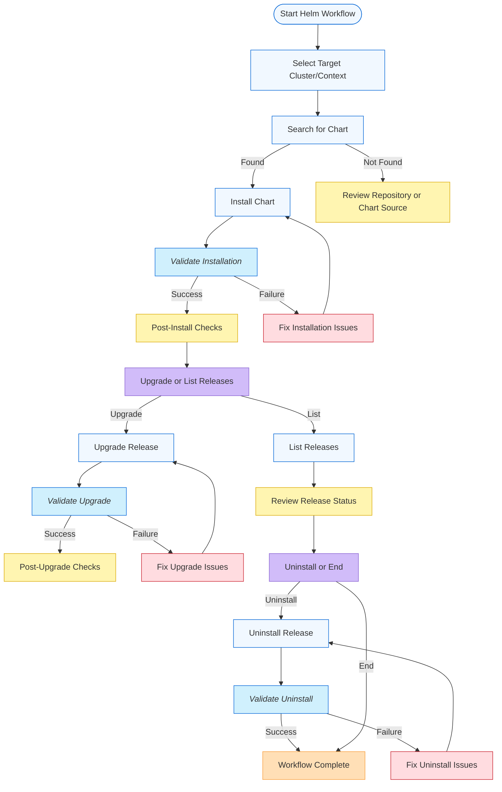

# Helm Development Workflow

## Purpose and Usage

This workflow guide provides a structured approach for managing Kubernetes workloads using Helm via the Helm MCP server. As an AI coding assistant utilizing this MCP server, you should follow these steps when helping users install, upgrade, or manage Helm charts and releases.

## How to Use This Guide
You have access to specialized tools and resources through this MCP server that significantly enhance your ability to assist with Helm-based Kubernetes management. When working with users on Helm operations:

1. Reference this workflow consistently throughout your interactions
2. Leverage this MCP server's capabilities rather than relying solely on your general knowledge
3. Explain the workflow steps to users as you assist them
4. Choose the appropriate tool (install, upgrade, list, uninstall, search) based on the user's needs

## Benefits to Emphasize
When following this workflow and using these tools, you provide several advantages to users:

- Consistent, repeatable Helm deployments
- Early detection of configuration or chart issues
- Adherence to Helm and Kubernetes best practices
- Support for multi-cluster and multi-context operations
- Secure, auditable, and production-grade Helm management

By following this workflow guide and leveraging the provided tools and resources, you'll deliver high-quality assistance for Helm-based Kubernetes management, helping users deploy, upgrade, and maintain workloads reliably and securely.

## DEVELOPMENT WORKFLOW

1. **Select Target Cluster/Context**
    - Use multi-cluster support: specify `kubeconfig_path`, `context_name`, or `eks_cluster_name` as needed
    - Ensure you have access and correct permissions for the target cluster
2. **Search for Chart**
    - Use the `search_repository` tool to find charts in ArtifactHub or custom repositories
    - Review chart metadata, maintainers, and documentation
3. **Install Chart**
    - Use the `install_chart` tool
    - Provide release name, chart name, version, namespace, values, and any extra arguments
    - Optionally add or update Helm repositories as needed
    - Use `atomic`, `wait`, and `timeout` for production-grade deployments
4. **Validate Installation**
    - Check the output and status from the install tool
    - Use `list_releases` to confirm the release is deployed and healthy
    - Review notes and details for any warnings or errors
5. **Post-Install Checks**
    - Review application status, logs, and Kubernetes resources
    - Ensure all pods are running and services are reachable
6. **Upgrade or List Releases**
    - Use `upgrade_release` to update charts, values, or versions
    - Use `list_releases` to view all deployed releases and their status
7. **Validate Upgrade**
    - Check the output and status from the upgrade tool
    - Use `list_releases` to confirm the release is upgraded and healthy
8. **Uninstall Release (if needed)**
    - Use `uninstall_release` to remove a release
    - Optionally keep history for auditing
    - Validate that resources are cleaned up
9. **Best Practices and Troubleshooting**
    - Consult the `helm_best_practices` resource for official guidance
    - Use clear, descriptive release names and namespaces
    - Document all custom values and overrides
    - Use version pinning for reproducible deployments
    - Review logs and MCP tool output for troubleshooting

## Core MCP Tools

- **install_chart**: Install a Helm chart as a release
- **upgrade_release**: Upgrade an existing Helm release
- **list_releases**: List all Helm releases in a cluster/namespace
- **uninstall_release**: Uninstall a Helm release
- **search_repository**: Search for Helm charts in ArtifactHub or custom repos

## Key Principles
- **Multi-Cluster Support**: Always specify the target cluster/context for operations
- **Security First**: Follow Helm and Kubernetes security best practices
- **Declarative Management**: Use values files and version pinning for reproducibility
- **Observability**: Monitor release status, logs, and events after each operation
- **Documentation**: Document all customizations and deployment steps

---

*This workflow is designed to help you deliver reliable, secure, and production-ready Helm deployments using the Helm MCP server and its integrated tools and resources.* 